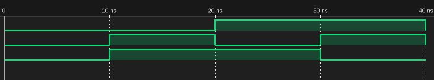

# 真理値表
| x_1 | x_2 | z |
| - | - | - |
| 0 | 0 | 0 |
| 0 | 1 | 1 |
| 1 | 0 | 1 |
| 1 | 1 | 0 |

# プログラム
## circuit.v
```
module circuit (
    input x1, x2,
    output z
);

wire w1, w2, w3, w4, w5;
not not1(w1,x1);
not not2(w2,x2);
or or1(w3,w1,w2);
and and1(w4,x1,w3);
and and2(w5,x2,w3);
or or2(z,w4,w5);
endmodule
```

## main.v
```
`timescale 1ns/1ns
module circuit_test;
    reg x1, x2;
    wire z;
    circuit f(x1,x2,z);
    initial begin
        x1 = 0; x2 = 0;
        $dumpfile("main.vcd");
        $dumpvars(0, circuit_test);
        $monitor("x1=%b x2=%b z=%b", x1, x2, z);
        
        // Test cases
        #10;     x1 = 0; x2 = 0; 
        #10;     x1 = 0; x2 = 1; 
        #10;     x1 = 1; x2 = 0; 
        #10;     x1 = 1; x2 = 1; 

        $finish;
    end
endmodule
```

# 実行結果
```
x1=0 x2=0 z=0
x1=0 x2=1 z=1
x1=1 x2=0 z=1
x1=1 x2=1 z=0
```

# 波形
