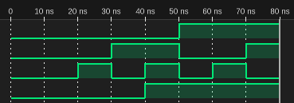

# 課題8-5 (1)
## 真理値表
| x_1 | x_2 | x_3 | z |
| - | - | - | - |
| 0 | 0 | 0 | 0 |
| 0 | 0 | 1 | 0 |
| 0 | 1 | 0 | 0 |
| 0 | 1 | 1 | 1 |
| 1 | 0 | 0 | 1 |
| 1 | 0 | 1 | 1 |
| 1 | 1 | 0 | 1 |
| 1 | 1 | 1 | 1 |

## プログラム
### circuit.v
```verilog
module circuit (
    input x1, x2, x3,
    output z
);
wire w1;
    and a(w1,x3,x2);
    or(z,x1,w1);
endmodule

```

### main.v
```verilog
`timescale 1ns/1ns
module circuit_test;
    reg x1, x2, x3;
    wire z;
    circuit f(x1,x2,x3,z);
    initial begin
        x1 = 0; x2 = 0; x3 = 0;
        $dumpfile("main.vcd");
        $dumpvars(0, circuit_test);
        $monitor("x1=%b x2=%b x3=%b z=%b", x1, x2, x3, z);
        
        // Test cases
        #10;     x1 = 0; x2 = 0; x3 = 0; 
        #10;     x1 = 0; x2 = 0; x3 = 1; 
        #10;     x1 = 0; x2 = 1; x3 = 0; 
        #10;     x1 = 0; x2 = 1; x3 = 1; 
        #10;     x1 = 1; x2 = 0; x3 = 0; 
        #10;     x1 = 1; x2 = 0; x3 = 1; 
        #10;     x1 = 1; x2 = 1; x3 = 0; 
        #10;     x1 = 1; x2 = 1; x3 = 1; 

        $finish;
    end
endmodule
```


## 実行結果
```
x1=0 x2=0 x3=0 z=0
x1=0 x2=0 x3=1 z=0
x1=0 x2=1 x3=0 z=0
x1=0 x2=1 x3=1 z=1
x1=1 x2=0 x3=0 z=1
x1=1 x2=0 x3=1 z=1
x1=1 x2=1 x3=0 z=1
x1=1 x2=1 x3=1 z=1
```

## 波形
