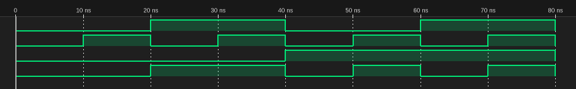

# プログラム
## mux.v
```verilog
module mux (
    input a, b, s,
    output y
);
assign y = s ? b : a;
endmodule
```

## main.v
```verilog
`timescale 1ns/1ns
module mux_test;
    reg a, b, s;
    wire y;
    mux f(a, b, s, y);
    
    initial begin
        a = 0; b = 0; s = 0;
        $dumpfile("main.vcd");
        $dumpvars(0, mux_test);
        $monitor("a=%b b=%b s=%b y=%b", a, b, s, y);
        
        // Test cases
        a = 0; b = 0; s = 0; #10; 
        a = 0; b = 1; s = 0; #10; 
        a = 1; b = 0; s = 0; #10; 
        a = 1; b = 1; s = 0; #10; 
        a = 0; b = 0; s = 1; #10; 
        a = 0; b = 1; s = 1; #10; 
        a = 1; b = 0; s = 1; #10; 
        a = 1; b = 1; s = 1; #10;
        $finish;
    end
endmodule
```

# タイムチャート
