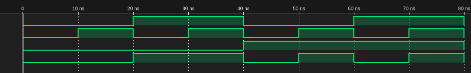

# プログラム
## circuit.v
```verilog
module my_mux (
    input a, b, s,
    output y
);
    wire sel_bar;
    wire a_and, b_and;

    not (sel_bar, s);
    and (a_and, a, sel_bar);
    and (b_and, b, s);
    or  (y, a_and, b_and);
endmodule
```

## main.v
```verilog
`timescale 1ns/1ns
module my_mux_test;
    reg a, b, s;
    wire y;
    my_mux f(a, b, s, y);
    
    initial begin
        a = 0; b = 0; s = 0;
        $dumpfile("main.vcd");
        $dumpvars(0, my_mux_test);
        $monitor("a=%b b=%b s=%b y=%b", a, b, s, y);
        
        // Test cases
        a = 0; b = 0; s = 0; #10; 
        a = 0; b = 1; s = 0; #10; 
        a = 1; b = 0; s = 0; #10; 
        a = 1; b = 1; s = 0; #10; 
        a = 0; b = 0; s = 1; #10; 
        a = 0; b = 1; s = 1; #10; 
        a = 1; b = 0; s = 1; #10; 
        a = 1; b = 1; s = 1; #10;
        $finish;
    end
endmodule
```

# タイムチャート
