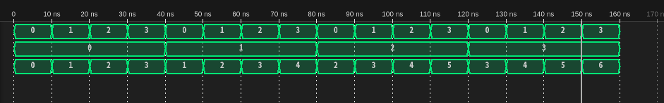

# プログラム
## circuit.v
```verilog
module kadai09_6 (
    input [1:0] a,
    input [1:0] b,
    output [3:0] z
);

    assign z = {2'b00, a} + {2'b00, b};

endmodule
```

# 実行結果
```
VCD info: dumpfile kadai09_6_test.vcd opened for output.
                   0: a = 00, b = 00, z = 0000
                  10: a = 01, b = 00, z = 0100
                  20: a = 10, b = 00, z = 1000
                  30: a = 11, b = 00, z = 1100
                  40: a = 00, b = 01, z = 0001
                  50: a = 01, b = 01, z = 0101
                  60: a = 10, b = 01, z = 1001
                  70: a = 11, b = 01, z = 1101
                  80: a = 00, b = 10, z = 0010
                  90: a = 01, b = 10, z = 0110
                 100: a = 10, b = 10, z = 1010
                 110: a = 11, b = 10, z = 1110
                 120: a = 00, b = 11, z = 0011
                 130: a = 01, b = 11, z = 0111
                 140: a = 10, b = 11, z = 1011
                 150: a = 11, b = 11, z = 1111
```

# タイムチャート
